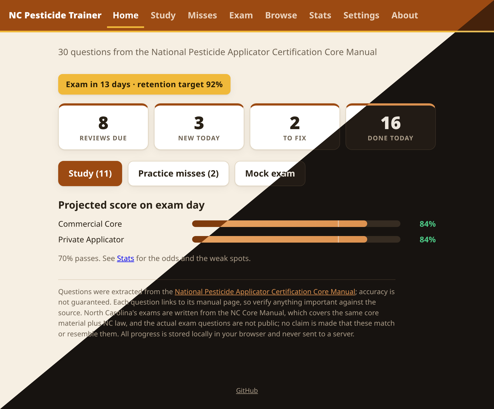
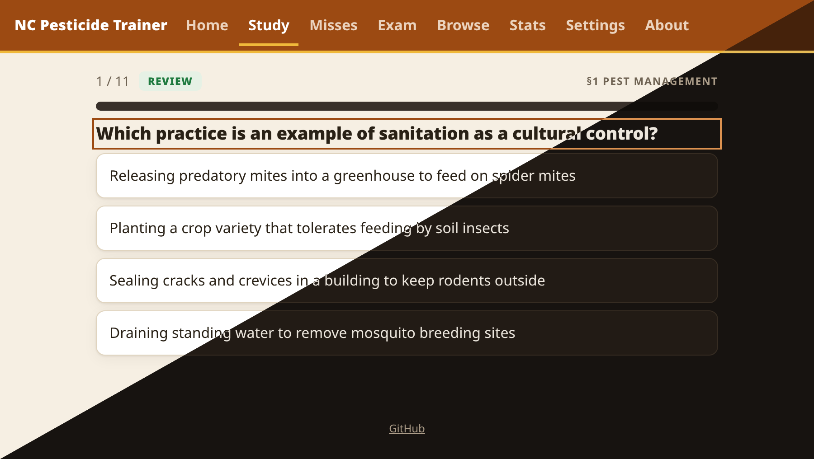
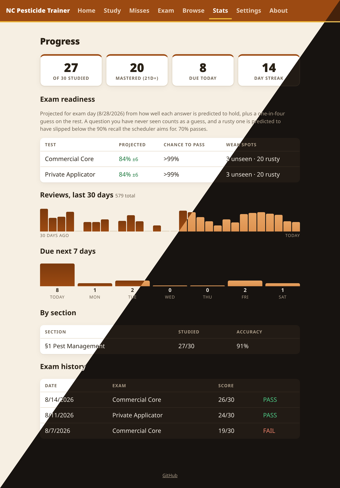

# Screenshots

Each image is split diagonally to show the light and dark themes, which follow the
browser's color scheme preference.

They are generated, not captured by hand. `generate.sh` feeds the app a seeded demo
profile (`seed.js`: a Commercial Core attempt twelve days out, with a failed first
mock and passing retakes on record), shoots each view once per theme in headless
Chrome, and composites the two across the diagonal. It needs Chrome or Chromium and
ImageMagick:

```
./docs/screenshots/generate.sh home study stats
```

## Home

Due reviews, new cards for the day, the misses pool, an exam countdown banner when a
test date is set, and the projected score for each test being studied for.



## Study

A spaced repetition session. The header shows the manual chapter the question came
from, and every question links to its page in the manual PDF.



## Stats

Mastery tiles, the exam readiness projection with the odds of passing, a 7-day due
forecast, per-chapter progress and accuracy, and exam history.


