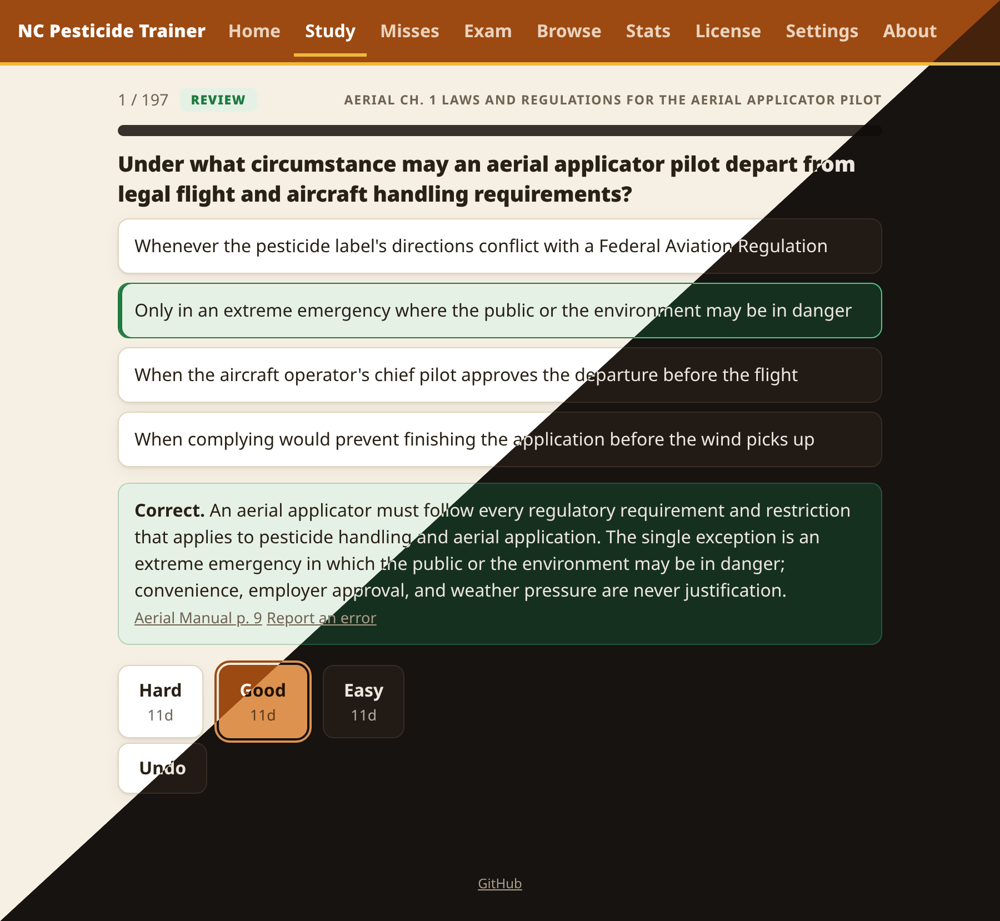
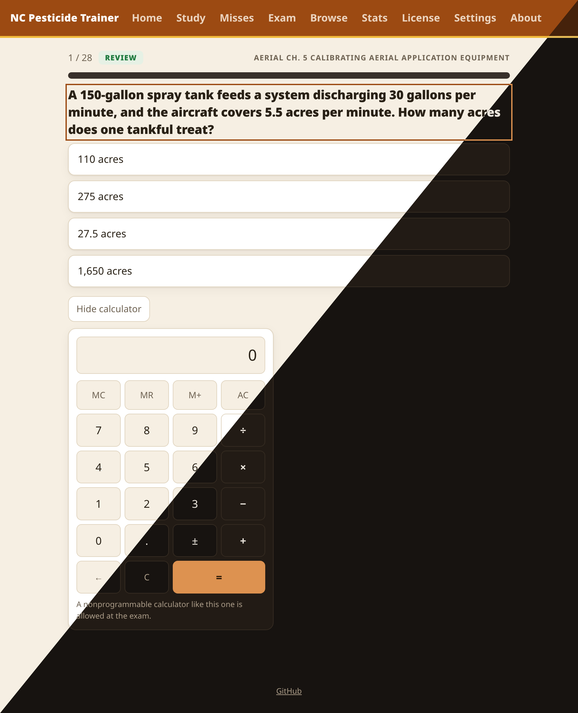
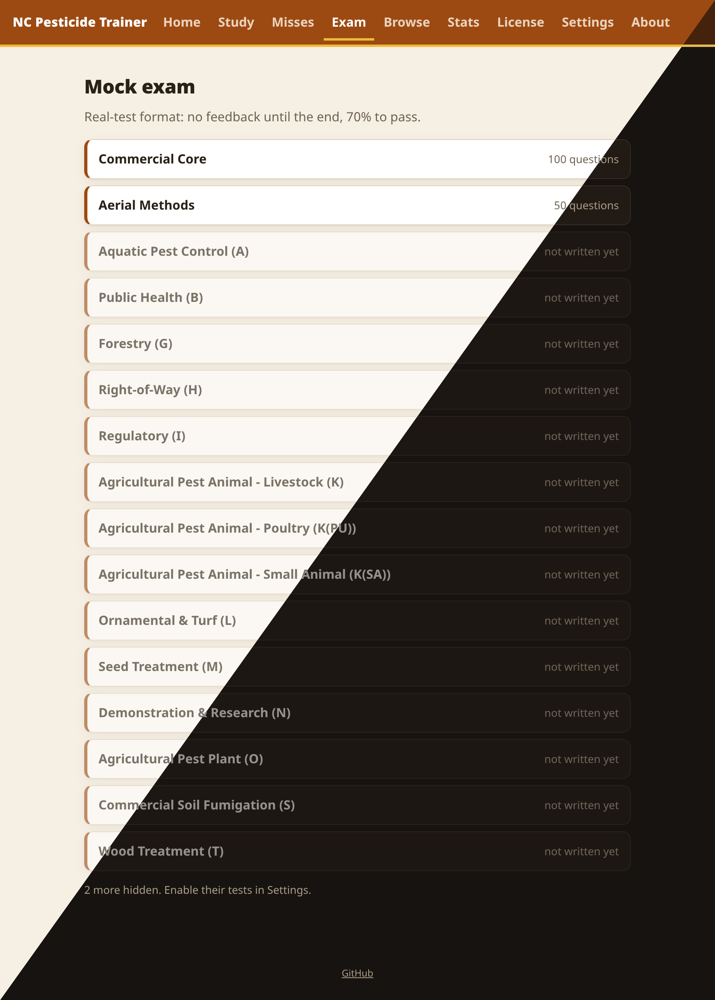
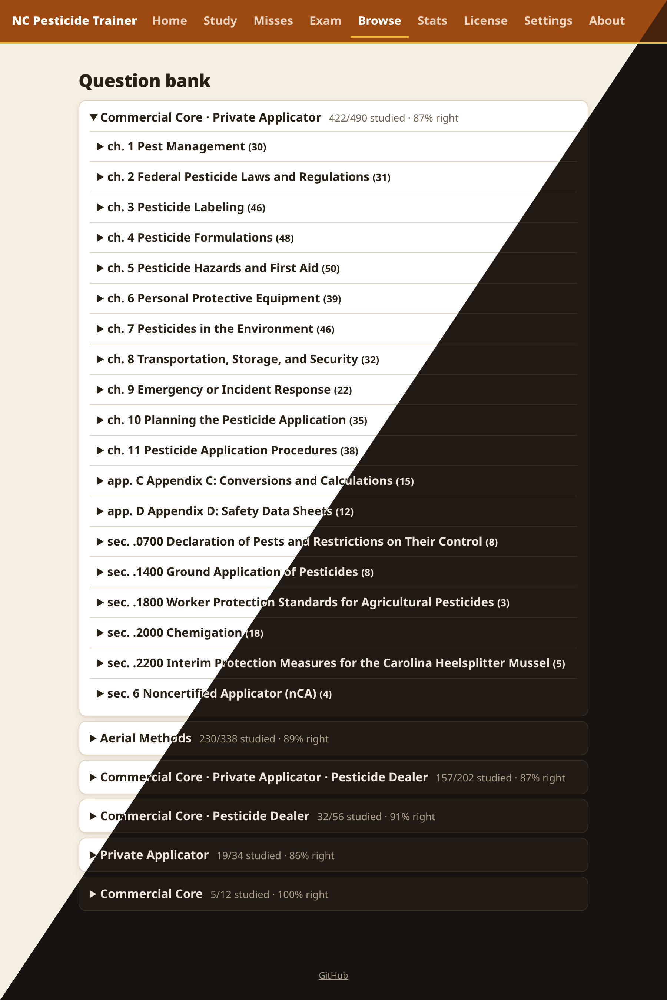
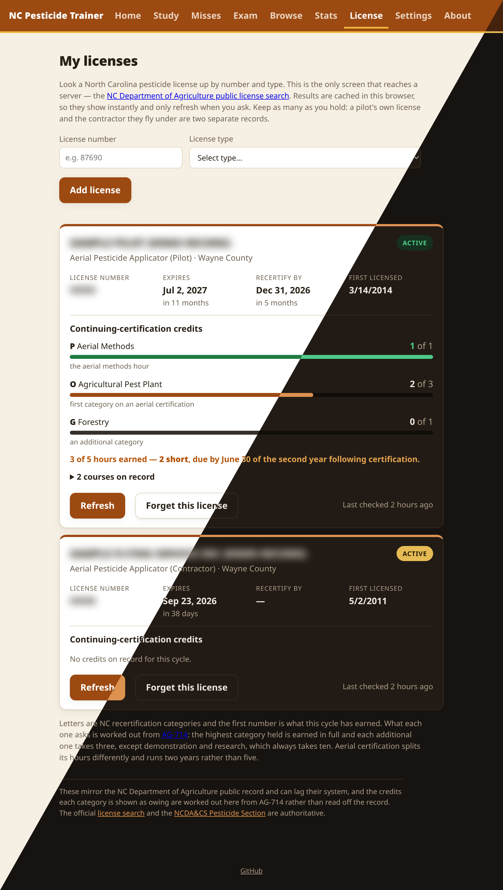
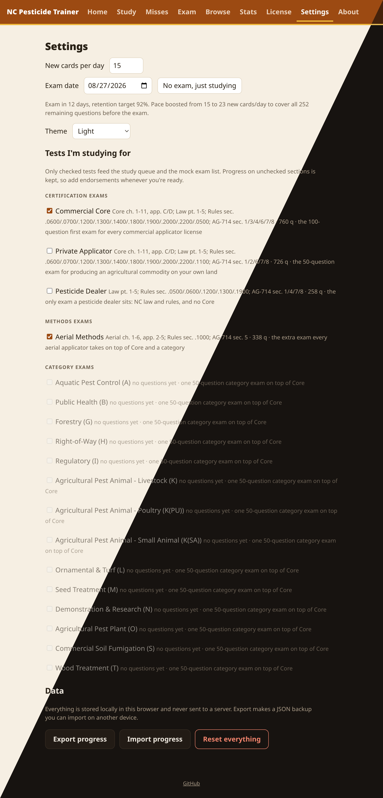

# Screenshots

Each image is split diagonally to show the light and dark themes, which follow the
browser's color scheme preference.

They are generated, not captured by hand. `generate.sh` feeds the app a seeded demo
profile (`seed.js`: an aerial applicator twelve days out from Commercial Core and
Aerial Methods, with a failed first mock and passing retakes on record), shoots each
view once per theme in headless Chrome, and composites the two across the diagonal.
It needs Chrome or Chromium and ImageMagick:

```
./docs/screenshots/generate.sh home study answer drill exam browse stats license settings
```

Each name is the view's own URL hash, so the list is also the app's route list. The
one exception is `answer`, which is not a route: `seed.js` turns it into `#study`
with the first question answered, because what a graded answer looks like is a
screen the app reaches by answering rather than by navigating.

## Home

Due reviews, new cards for the day, the misses pool, an exam countdown banner when a
test date is set, and the projected score for each test being studied for.


## Study

A spaced repetition session. The header shows the manual chapter the question came
from.


## Answering

Every question is explained on the spot and cites the page it came from, and a
correct answer is rated Hard, Good, or Easy — the interval each rating would set is
on the button. Undo takes a stray tap back.



## Calculation drills

Calibration and dosage questions draw fresh numbers every time, so the arithmetic is
practised rather than the answer memorized. `#drill` runs them on demand, and the
on-screen calculator is the nonprogrammable kind the exam allows.



## Mock exam

The exams North Carolina actually gives, at their real lengths. Exams with no
questions written yet are listed but unselectable, so the gap is visible.



## Browse

The whole bank grouped by the exams a chapter belongs to, with each group's studied
count and accuracy; open a chapter for its questions, schedules, and answers.



## Stats

Mastery tiles, the exam readiness projection with the odds of passing and the weak
spots behind it, the last 30 days of reviews, a 7-day due forecast, per-chapter
progress and accuracy, and exam history.


## License

Looks a North Carolina pesticide license up in the Department of Agriculture's
public search, keeps as many as you hold — here a pilot's own certification and the
contractor they fly under — and scores each one's recertification credits against
what AG-714 says its categories owe. The only screen that reaches a server.

The two records are invented rather than a real licensee's, and the name and license
number are blurred on top of that; everything the card is worth showing is not
personal and stays legible.



## Settings

Daily pace, exam date, theme, and which tests are being studied for — each listed
with the chapters it covers and how many questions back it. Export and import move
progress between devices.


